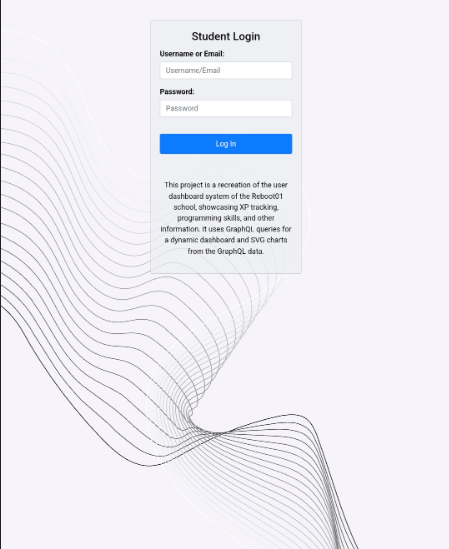
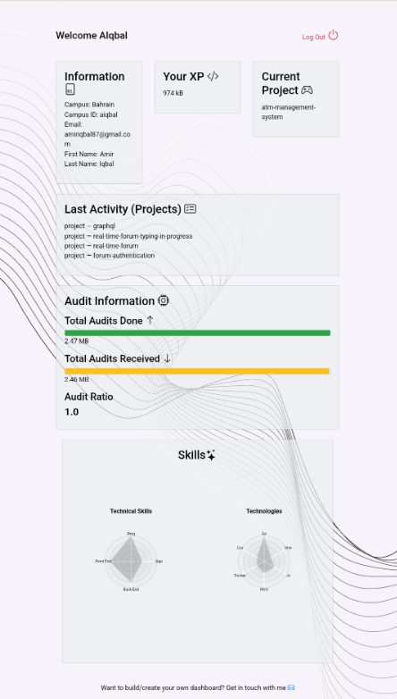

# 🌐 Web Application with GraphQL, JWT Authentication, and Data Visualization

This project is a recreation of the @Talent dashboard system of the Reboot01 school. It uses GraphQL queries for a dynamic dashboard and SVG charts from the GraphQL data. The web application demonstrates user authentication, data visualization, and interaction with a GraphQL API. It includes features such as JWT-based authentication, progress bars, and radar charts.


## 📋 Table of Contents

- [Features](#features)
- [Technologies Used](#technologies-used)
- [Setup and Installation](#setup-and-installation)
- [Usage](#usage)
- [Learning Outcome](#learning-Outcome)

## ✨ Features

- 🔒 User authentication using JWT
- 📊 Data visualization with D3.js
- 🌗 Responsive design with light and dark themes
- 🚀 Interaction with a GraphQL API
- 📈 Progress tracking and display

## 🛠 Technologies Used

- 🖥 HTML, CSS, JavaScript
- 📈 D3.js for data visualization
- 🕸 GraphQL for API interaction
- 🔑 JWT for authentication
- 🍪 `js-cookie` for handling cookies

## ⚙️ Setup and Installation

1. Clone the repository:
    ```sh
    git clone <repository-url>
    cd <repository-directory>
    ```

2. Install dependencies:
    ```sh
    npm install
    ```

3. Open [`index.html`] in your browser to access the login page.

## 🚀 Usage

### 🔑 Login

1. Open [`index.html`] in your browser.
2. Enter your username/email and password.
3. On successful login, you will be redirected to [`dashboard.html`].



### 📊 Dashboard

- The dashboard displays various data visualizations including progress bars and radar charts.
- You can log out by clicking the logout button, which will clear the JWT cookie and redirect you to the login page.



## 🎯 Learning Outcome

- 🕸 GraphQL
- 🛠 GraphiQL
- 🌐 Hosting
- 🔑 JWT
- 🔒 Authentication
- 🔐 Authorization
- 🖥 UI/UX

